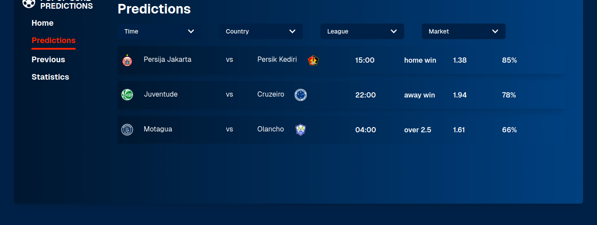
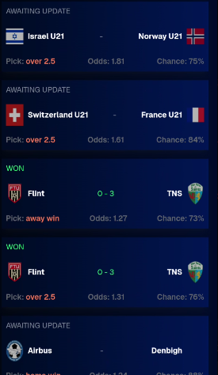

# AlgoFooty  
**Smart Football Predictions | Automated Data Extraction | AI-Powered Forecasts**

AlgoFooty is a full-stack football analytics platform that automatically scrapes match data from Flashscore, processes it using deep-learning models, and delivers clean predictions through a modern frontend interface.

---

## Screenshots

### Match Predictions Page  


### Mobile view Page  




---

## Features

### Automated Flashscore Scraping
- Fully automated match extraction  
- Scrapes fixtures, previous stats, odds, H2H, standings  
- Intelligent retries + error recovery  
- Concurrency support  

### AI Prediction Engine
- Deep-learning models for:
  - Home/Away predictions  
  - Over/Under 2.5 goals    
- Fast feature creation & normalization  
- Efficient prediction pipelines  

### Backend API (FastAPI)
- REST endpoints for predictions & match data  
- Immediate + scheduled queue processing  
- Background tasks with robust error handling  

### Frontend (NextJs + TailwindCSS)
- Modern UI  
- Predictions, match metadata, icons & badges  
- Smooth transitions  
- Fully mobile-friendly  

---

## Project Structure

```BASH
AlgoFooty/
│
├── backend/
│ ├── flashscore/ # Scrapers, navigators, prediction pipeline
│ ├── API/ # FastAPI API endpoints
│ ├── outcome/ # Match result processors
│ └── processing/ # Feature engineering logic
│
├── frontend/
│ ├── assets/ # Screenshots & UI images
│ ├── components/
│ ├── pages/
│ └── styles/
│
└── README.md'
```
---

# Installation & Setup

## Clone the Repository
```bash
git clone https://github.com/prototypedave/AlgoFooty.git
cd AlgoFooty
```

# Backend Setup

## Create a virtual environment
```bash
python3 -m venv .venv
source .venv/bin/activate
```

## Install dependencies
```bash
pip install -r backend/requirements.txt
```

## Start the API
```bash
uvicorn API.main:app --reload
```

Backend will run at:
http://localhost:8000

# Frontend Setup
```bash
cd frontend
npm install
npm run dev
```

Frontend will run at:
http://localhost:3000

# How It Works
## 1. Scraping

Scrapes fixtures, stats, standings, odds

Saves structured match data

## 2. Feature Processing

Cleans and transforms data

Builds model-ready feature vectors

## 3. Prediction Pipeline

Runs deep-learning models

Generates probabilities & outcomes

## 4. Frontend Rendering

Displays final predictions

League, country, status & badges included


# Contributing
Pull requests and issues are welcome.
For major feature changes, please open an issue first.